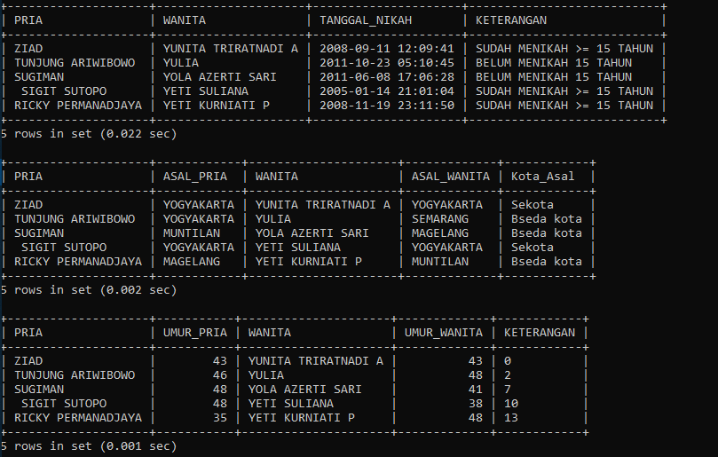

# SQL Script for Civil Record Database Management

## Overview
This script sets up a database named `dbCatatanSipil` to manage civil records, including individuals' details and their marital information. It performs operations such as inserting data, creating relationships, and querying specific details using SQL.

---

## Database Structure

### Database Creation
- Drops the database `dbCatatanSipil` if it exists.
- Creates a new database `dbCatatanSipil`.
- Uses the database `dbCatatanSipil`.

### Table: `tblInfo`
- **Columns:**
  - `noid` (INT): Primary key, unique identifier for each individual.
  - `nama` (VARCHAR(20)): Name of the individual.
  - `jkelamin` (ENUM): Gender ('P' for male, 'W' for female).
  - `tgllahir` (DATETIME): Date and time of birth.
  - `kotaasal` (VARCHAR(10)): City of origin.
  - `pasangan` (INT): Foreign key, references `noid` to indicate the spouse.
  - `tglnikah` (DATETIME): Date and time of marriage.
- Establishes a foreign key relationship with the `pasangan` column, referencing the `noid` column in the same table.

### Data Insertion
Inserts sample records into `tblInfo` representing individuals and their marital details.

---

## Queries

### Query 1: List of Married Couples with Marriage Duration
**Description:** Retrieves the names of married couples, their marriage date, and a statement indicating if they have been married for 15 years or more.
**SQL:**
```sql
SELECT pria.nama AS PRIA,
       wanita.nama AS WANITA,
       pria.tglnikah AS TANGGAL_NIKAH,
       IF(YEAR(NOW()) - YEAR(pria.tglnikah) >= 15, 'SUDAH MENIKAH >= 15 TAHUN', 'BELUM MENIKAH 15 TAHUN') AS KETERANGAN
FROM tblInfo AS pria
INNER JOIN tblInfo AS wanita ON pria.pasangan = wanita.noid
WHERE pria.jkelamin = 'P' AND wanita.jkelamin = 'W';
```

### Query 2: Marital Partners and City Comparison
**Description:** Retrieves married couples, their cities of origin, and whether they are from the same city or different cities.
**SQL:**
```sql
SELECT pria.nama AS PRIA,
       pria.kotaasal AS ASAL_PRIA,
       wanita.nama AS WANITA,
       wanita.kotaasal AS ASAL_WANITA,
       IF(pria.kotaasal = wanita.kotaasal, 'Sekota', 'Bseda kota') AS Kota_Asal
FROM tblInfo AS pria
INNER JOIN tblInfo AS wanita ON pria.pasangan = wanita.noid
WHERE pria.jkelamin = 'P' AND wanita.jkelamin = 'W' AND YEAR(pria.tgllahir) < 1990;
```

### Query 3: Age Difference Between Spouses
**Description:** Calculates and compares the ages of married couples, indicating the age difference or equality.
**SQL:**
```sql
SELECT pria.nama AS PRIA,
       (YEAR(NOW()) - YEAR(pria.tgllahir)) AS UMUR_PRIA,
       wanita.nama AS WANITA,
       (YEAR(NOW()) - YEAR(wanita.tgllahir)) AS UMUR_WANITA,
       CASE
           WHEN pria.tgllahir < wanita.tgllahir THEN YEAR(wanita.tgllahir) - YEAR(pria.tgllahir)
           WHEN pria.tgllahir > wanita.tgllahir THEN YEAR(pria.tgllahir) - YEAR(wanita.tgllahir)
           ELSE 'SAMA'
       END AS KETERANGAN
FROM tblInfo AS pria
INNER JOIN tblInfo AS wanita ON pria.pasangan = wanita.noid
WHERE pria.jkelamin = 'P' AND wanita.jkelamin = 'W';
```

---

## Notes
- The data assumes consistent entries for individuals and their spouses.
- The queries demonstrate the use of `JOIN`, conditional logic (`IF`, `CASE`), and date functions (`YEAR`, `NOW`).
- The database is designed to highlight relationships and demographics within the civil record system.

